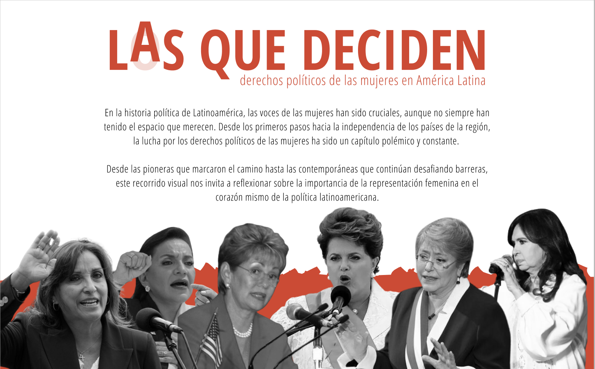

# LasQueDeciden



LasQueDeciden es un proyecto de visualización de datos que se centra en los derechos políticos de las mujeres en América Latina. Este proyecto busca destacar la importancia de la participación de las mujeres en la política y mostrar cómo ha cambiado a lo largo del tiempo.

## Diseño

El diseño del proyecto se realizó utilizando Figma. Podes ver el diseño completo [aquí](https://www.figma.com/file/9VCyYXbbrsW7TkT0DvSgge/Trabajo-Final---Dataviz?type=design&node-id=129%3A121&mode=design&t=yB8VxkYFa7DBgtW6-1).


## Desarrollo
Para desarrollar la visualización de datos sobre derechos políticos de las mujeres, opté por utilizar Next.js y React, además de SVG para ciertas animaciones.

En cuanto a la creación de gráficos,usé Flourish, una herramienta que facilita la generación de visualizaciones interactivas y atractivas.

Para el procesamiento de datos, usé Python, como se evidencia en el notebook disponible en el repositorio.


## Troubleshutting - Animaciones
Si las timelines aparecen estáticas en el sitio deployado en Vercel, recomiendo correr localmente el proyecto (Estoy solucionando este problema en Vercel).
Deberías ver algo así:


Para hacerlo, necesitás tener node instalado. Una vez que lo tengas, corres:

```
npm install next
```
Importante: chequeá las dependencias!
Si ya instalaste todo, con correr:

```
npm run dev
```
Ya deberías poder ver el proyecto en localhost:3000
